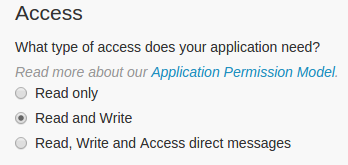

# Tweeting Babbage

Make a Babbage Bear that takes photos and sends tweets!

## Create a Twitter Account

1. Create a Twitter account for your Babbage Bear at [twitter.com](https://twitter.com)

    

You might also want to upload a photo and fill out the bio.

## Create a Twitter Application

1. Go to [apps.twitter.com](https://apps.twitter.com) and click the **Create New App** button.

    

1. Complete the application details form. You must enter an application name, description, website (this can be `http://www.raspberrypi.org` if you don't have one). Leave the Callback URL field blank and proceed.

1. Modify your app permissions from **Read only** to **Read and write**.

    

1. Click the 'Keys and Access Tokens' tab and create an access token.

    

1. Once you've clicked the **Create an Access Token** button, refresh the page and you'll see a new section beneath the **Application Settings** with your access token details.

1. You should now be able to see your **Consumer key**, **Consumer secret**, **Access token** and **Access token secret**. You'll need these four keys to connect to your Twitter account from your Python code. Don't share these keys with anyone as they can be used (without the account's password). If you share your code online, make sure not to include these keys. If you ever accidentally share or publish these keys, you should regenerate the keys at [apps.twitter.com](https://apps.twitter.com).


## Connect to Twitter from Python

Before we perform surgery on Babbage and insert a camera up his rear end, let's get the code doing what we want it to.

1. Boot your Raspberry Pi to the Desktop.

1. Launch `LXTerminal` from the Desktop and create a folder for your project with the following command:

    ```bash
    mkdir tweeting-babbage
    ```

1. Enter this folder with `cd tweeting-babbage` and create the files we'll be using:

    ```bash
    touch auth.py twitter.py tweeting-babbage.py
    ```

1. Launch `IDLE3` from the Desktop and open these three Python files by clicking `File > Open`, navigating to the `tweeting-babbage` folder and highlighting all the files.

1. In `auth.py` paste your API keys from [apps.twitter.com](https://apps.twitter.com) in to variables like so:

    ```python
    consumer_key        = 'ABCDEFGHIJKLKMNOPQRSTUVWXYZ'
    consumer_secret     = '1234567890ABCDEFGHIJKLMNOPQRSTUVXYZ'
    access_token        = 'ZYXWVUTSRQPONMLKJIHFEDCBA'
    access_token_secret = '0987654321ZYXWVUTSRQPONMLKJIHFEDCBA'
    ```

1. Save `auth.py` and go to `twitter.py`. Import the `twython` library and the variables from `auth.py`:

    ```python
    from twython import Twython
    from auth import (
        consumer_key,
        consumer_secret,
        access_token,
        access_token_secret
        )
    ```

1. Make a connection with the Twitter API using this set of keys:

    ```python
    twitter = Twython(
        consumer_key,
        consumer_secret,
        access_token,
        access_token_secret
        )
    ```

1. Create a `main()` function which will be called when the script is run. We'll start with a basic "Hello world" tweet to test the connection works:

    ```python
    def main():
        message = "Hello world!"
        twitter.update_status(status=message)
    ```

    This uses the API's `update_status()` function to send a text tweet containing the text "Hello world!".

1. We'll also add an instruction at the end to run the `main()` method when the script is called directly:

    ```python
    if __name__ == '__main__':
        main()
    ```

    Your code should now look like this:

    ```python
    from twython import Twython
    from auth import (
        consumer_key,
        consumer_secret,
        access_token,
        access_token_secret
        )

    def main():
        message = "Hello world!"
        twitter.update_status(status=message)
        print("Tweeted: %s" % message)

    if __name__ == '__main__':
        main()
    ```

1. Now save (`Ctrl + S`) and run with `F5`. You should see the message "Tweeted: Hello world!". Go to your Twitter profile in a web browser to verify it sent! This will be at `twitter.com/username` where `username` is your Twitter account's username.


Note that sending multiple tweets with the exact same text are classed as duplicates and rejected by Twitter. If you want to test it again, try tweeting a different message.

If you see an error, your API keys may be incorrect. Be sure to copy them exactly and check the spelling of the variables. Also check your Pi is online.


## Tweet a picture

Now the Twitter connection has been tested, let's try to upload a picture. Rather than try to hook up the camera now we'll test it independently.

1. Find a picture, copy one to your Raspberry Pi or download one from the internet and save it to your home folder. Make a note of its location (something like `/home/pi/Downloads/image.jpg`).

    

1. Modify the `main()` function in the code accordingly:

    ```python
    message = "Hello world - here's a picture!"
    with open('/home/pi/Downloads/image.jpg', 'rb') as photo:
        twitter.update_status_with_media(status=message, media=photo)
    ```

    Making sure to get full path to the image correctly.

    This opens the file and uses the `update_status_with_media()` function to upload the image along with the tweet text.

1. Run the code and see if it tweets the text and image together!

    

## Take a picture with the Pi camera

1. With the Pi switched off, connect the camera to the camera port.

    

1. Boot the Pi and from the command line or LXTerminal, test it works with the command `raspistill -k`. If you see the camera's image on the screen, you know it's working. Press `Ctrl + C` to exit the preview.

1. Now open a new Python window in IDLE3, save as `camera.py` and enter the following code:

    ```python
    from picamera import PiCamera
    from time import sleep

    with PiCamera() as camera:
        camera.start_preview()
        sleep(3)
        camera.capture('/home/pi/image.jpg')
        camera.stop_preview()
    ```

    This is a test script to check we can take a picture from Python.

1. Run with `F5` and you should see a preview on the screen for 3 seconds before the camera takes the picture.

1. Open the file manager and you should see `image.jpg`. Double click the icon to open it up.

    

## Tweet a picture from the Pi camera

Now we'll copy the `picamera` code we just used to take a picture in to the `twitter.py` file.

1. First add the `import` lines at the top:

    ```python
    from picamera import PiCamera
    from time import sleep
    ```

    Imports are best kept at the top of the line before anything else.

1. Then add the `picamera` lines in the `main()` method:

    ```python
    with PiCamera() as camera:
        camera.start_preview()
        sleep(3)
        camera.capture('/home/pi/image2.jpg')
        camera.stop_preview()

    message = "Here's a Pi camera picture!"
    with open('/home/pi/image2.jpg', 'rb') as photo:
        twitter.update_status_with_media(status=message, media=photo)
    ```

    Be sure to use the correct file path - it should be the same in both places.

1. Now run the code and it will save to `image2.jpg` in the home folder and upload it to Twitter.

1. Check Twitter to see if it worked!

    
