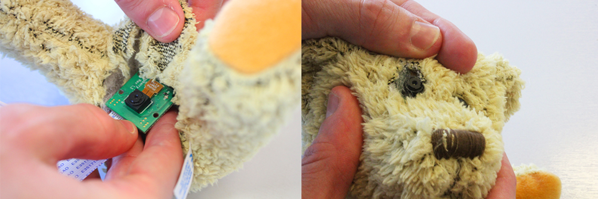
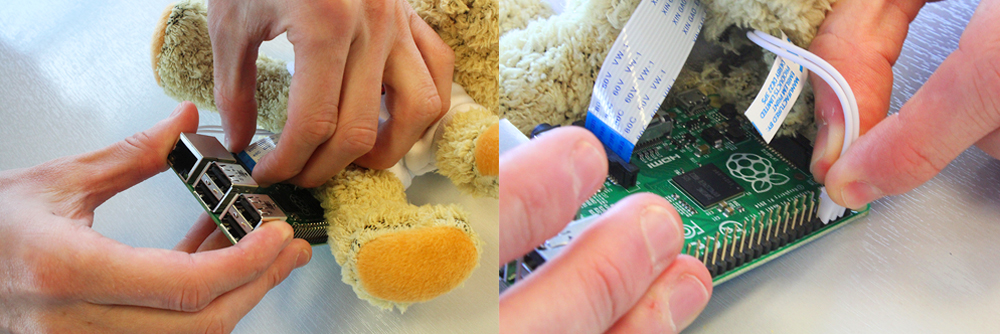
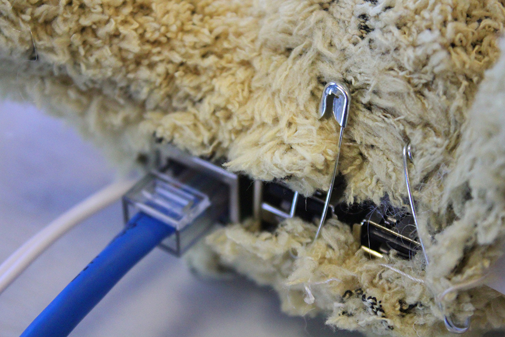
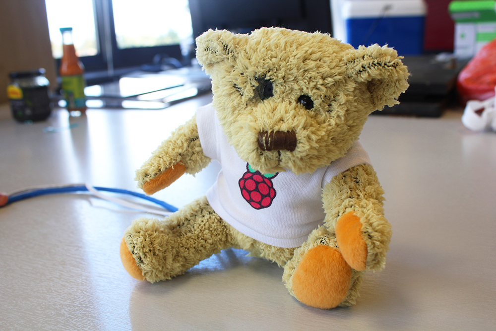

# Tweeting Babbage

Make a Babbage Bear that takes photos and sends tweets!

## Put it all together

Now that we've got the button triggering the camera, and we know we can tweet pictures taken with the camera, let's put it all together in `babbage.py`.

1. Add the GPIO library import and GPIO setup lines to the top.

1. Add the `wait_for_edge()` line before the capture. You probably want to leave the `sleep()` in this time.

1. Press the button when the preview appears, and it should tweet the picture from the camera.

## Add continuation

Next we'll add a loop so a picture is taken every time the button is pressed.

1. Remove the preview from the code as we won't have a screen attached. Remove the `start_preview()` and `stop_preview()` lines as well.

1. Add a `while` loop to make the button press camera trigger continue indefinitely:

    ```python
    with PiCamera() as camera:
        while True:
            GPIO.wait_for_edge(14, GPIO.FALLING)
            timestamp = datetime.now().isoformat()
            photo_path = '/home/pi/tweeting-babbage/photos/%s.jpg' % timestamp
            sleep(3)
            camera.capture(photo_path)

            with open(photo_path, 'rb') as photo:
                twitter.update_status_with_media(status=message, media=photo)
    ```

    Make sure all the code is indented to be inside the `while` loop.

## Final code

Your final code should look something like this:

```python
from twython import Twython
from picamera import PiCamera
from time import sleep
from datetime import datetime
import RPi.GPIO as GPIO
import random
from auth import (
    consumer_key,
    consumer_secret,
    access_token,
    access_token_secret
)

GPIO.setmode(GPIO.BCM)
GPIO.setup(14, GPIO.IN, GPIO.PUD_UP)

twitter = Twython(
    consumer_key,
    consumer_secret,
    access_token,
    access_token_secret
)

messages = [
    "Hello world",
    "Hi there",
    "My name is Babbage",
    "What's up?",
    "How's it going?",
    "Have you been here before?",
    "Get a hair cut!",
]

def main():
    message = random.choice(messages)

    with PiCamera() as camera:
        while True:
            GPIO.wait_for_edge(14, GPIO.FALLING)
            timestamp = datetime.now().isoformat()
            photo_path = '/home/pi/tweeting-babbage/photos/%s.jpg' % timestamp
            sleep(3)
            camera.capture(photo_path)

            with open(photo_path, 'rb') as photo:
                twitter.update_status_with_media(status=message, media=photo)

if __name__ == '__main__':
    main()
```

But feel free to make any modifications you see fit!

Test that it works by navigating to the `tweeting-babbage` folder in the terminal with `cd` and running `sudo python3 babbage.py`. Press `Ctrl + C` to exit.

## Automation

Lastly, we'll make the Python script run as soon as the Pi boots, as we won't have a monitor attached.

1. Open the `rc.local` file for editing from the command line:

    ```bash
    sudo nano /etc/rc.local
    ```

1. Go down to the end of the file and add the following line just before the final line `exit 0`:

    ```
    python3 /home/pi/tweeting-babbage/babbage.py &
    ```

    This runs the script when the Pi boots. The ampersand (&) is important as it makes the script run in a separate process, so that the Pi can continue to boot.

1. Save and exit with `Ctrl + O`, `Enter` and `Ctrl + X`.

1. Reboot the Pi without a monitor and wait for it to boot (the activity light on the Pi should stop flashing). Try pressing the button and watching it upload the picture to Twitter.

    If you have issues, try reconnecting a monitor to see what's going on.

## Tweeting Babbage

Now that we have the code doing exactly what we want, let's put it into action (or into Babbage, to be more precise).

1. Take a fresh Babbage, and make an incision in its rear end with scissors. Cut all across the bottom from the thighs, a little more than the width of the Pi.

    

1. Remove as much stuffing from the body as possible. Remove it from the head, body and right arm, but leave the left arm and both legs.

    

1. Insert the button into the bear with wires attached, placing the button inside the paw, and leaving the wire trailing out. There's no need to have it attached to the Pi yet.

1. Replace the arm stuffing to keep the button in place.

1. Cut out the right eye with scissors. Try not to remove any fabric; just loosen the eye from the socket and remove it.

    

1. Insert the camera module into the bear, unattached, carefully positioning the camera lens pointing out of the eye hole.

    

1. Replace the head stuffing behind the camera module to keep it in place.

1. Connect the camera module to the Pi and wire up the push button to the pins used earlier: ground and GPIO 14. Now connect the Pi's power cable.

    

    

1. With the power, camera and GPIO button connected to the Pi, carefully insert the Pi into the bear SD card slot first, with the USB ports facing up at the bottom end.

    

1. Replace the body stuffing to pad it out.

    

1. Connect the Ethernet cable or pre-configured USB WiFi dongle.

    

1. Use safety pins to seal the incision wound over the USB ports.

    

1. Connect the Pi's power supply to a wall socket and wait for it to boot. Once it's ready, every time you press the button in the paw it will take a picture and tweet it!

Now you have a Tweeting Babbage!


